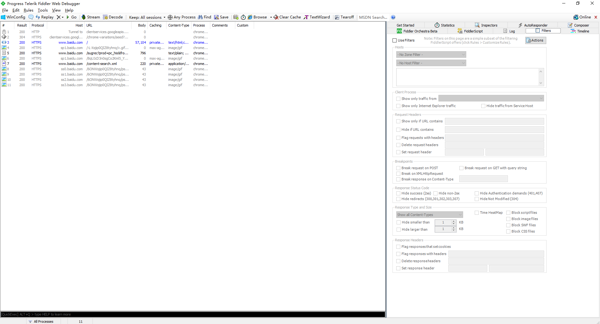
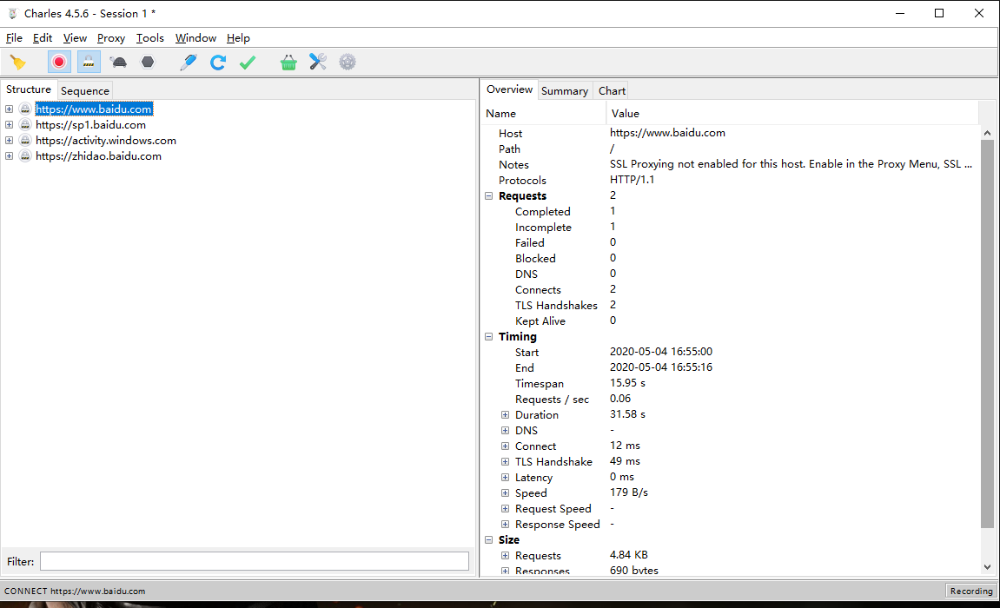
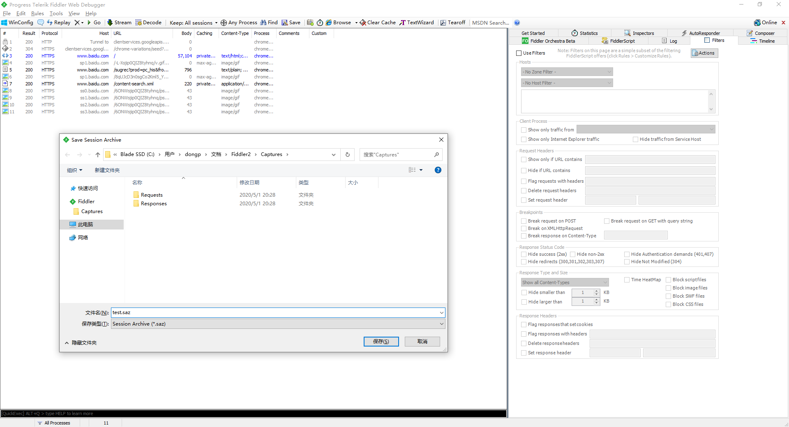
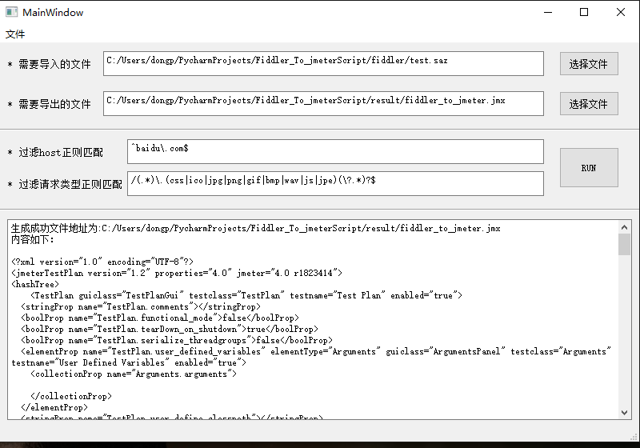

# Fiddler 或 Charles 文件转换为 Jmeter4.0以上脚本
 
解决脚本录制问题,可以将Fiddler或Charles转换成对应的Jmeter脚本,实现部分内容的参数化配置，通过修改部分参数或参数化可以对http协议的接口进行自动化测试或简单的压力测试 
博客地址：https://www.cnblogs.com/fbyyx/p/12827415.html
## 操作步骤
1.1 打开Fiddler/Charles录制请求 
1.1.1 Fiddler录制 
 
1.1.2 Charles录制 
 
1.2 将需要的HTTP请求导出 
1.2.1 Fiddler导出为saz格式 
 
1.2.1 Charles导出为chlsj格式 
 
1.3 执行脚本 
1.3.1 参数说明 
1.3.1.1 需要导入的文件：saz文件（Fiddler文件）,chlsj(Charles文件) 
1.3.1.2 需要到处的文件：jmx文件（生成的jmeter脚本文件） 
1.3.1.3 过滤Http请求：不满足host则过滤，为正则匹配方式 
1.3.1.4 过滤Http请求，通过/path部分，满足则过滤，为正则匹配方式 
1.3.2 页面效果 
 
1.3.3 结果展示 
 
1.4 jmeter运行结果 
 
## 注意
1.注意HTTPS 抓包工具需要安装证书否则导出的请求的method 为 CONNECT，执行脚本时会忽略CONNECT 
2.根据导入文件的后缀进行判断切记不要改后缀名 
3.有bug记得邮件告知或者微信：dongpengfei826153155@gmail.com 记得附带脚本方便定位问题 
4.目前只考虑windows系统 
 
## TODO
1.目前只支持GET和POST请求 
2.jmeter低版本暂不支持,目前导出的脚本是jmeter4.0,可以导出后手动转换脚本，后续完善 
3.Charles其他格式的支持 
