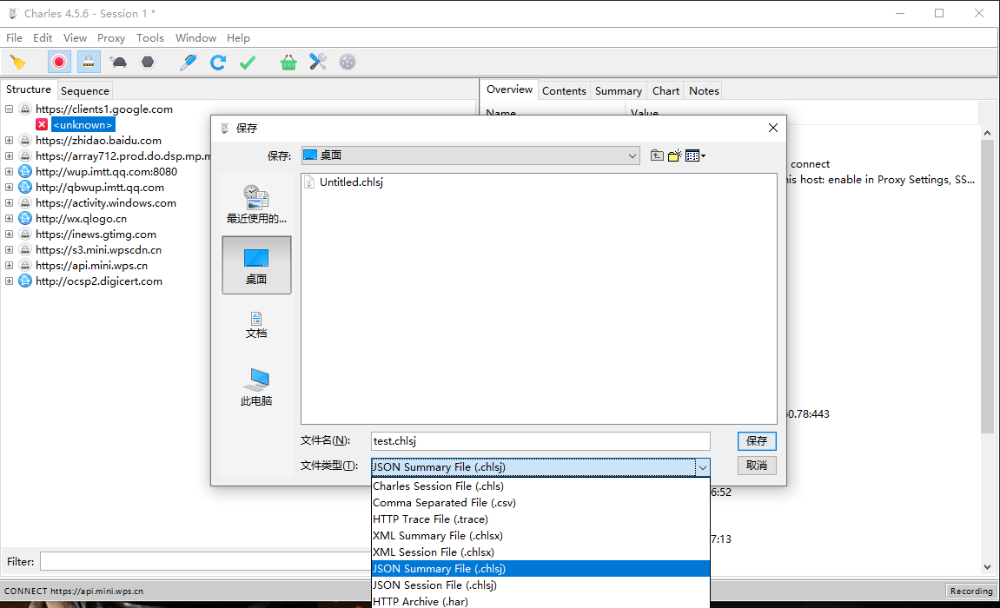
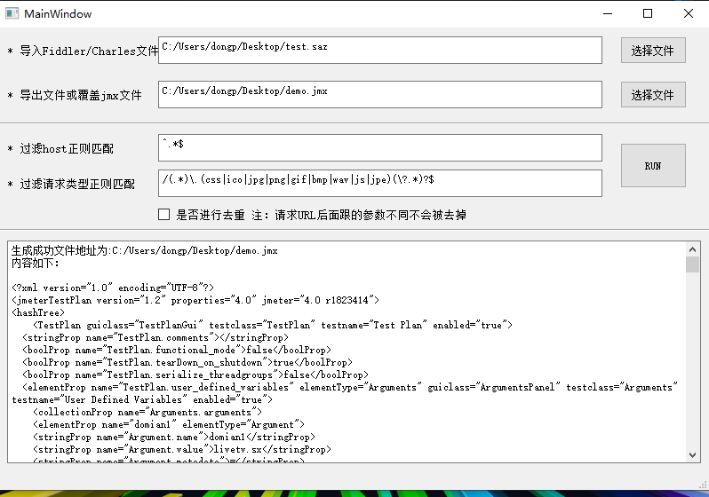
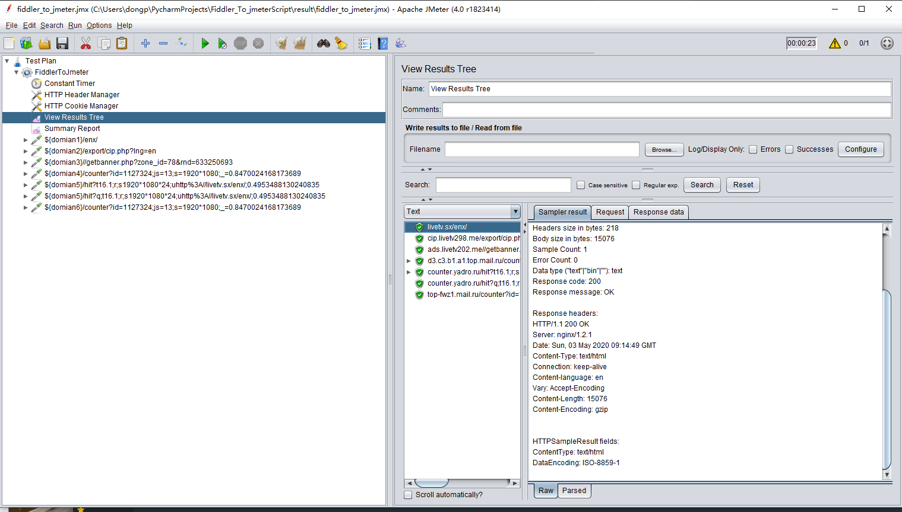
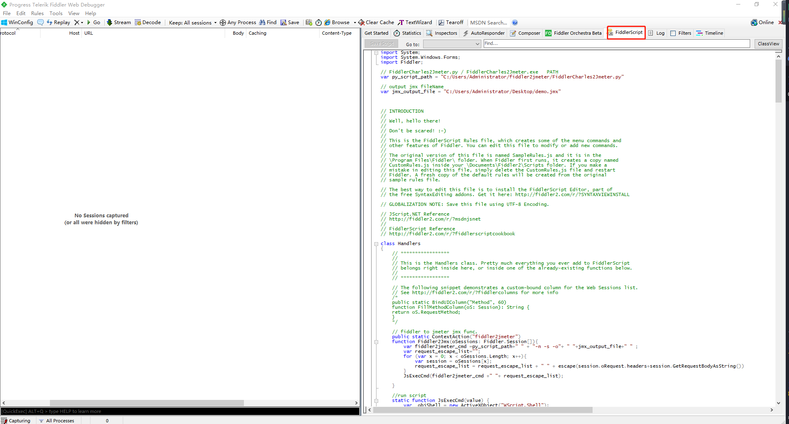
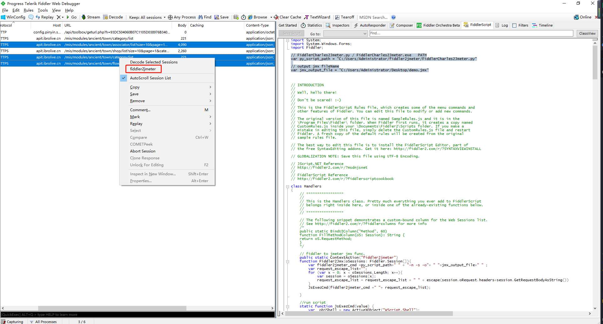

# Fiddler 或 Charles 文件转换为 Jmeter4.0以上脚本
<br>
解决脚本录制问题,可以将Fiddler或Charles转换成对应的Jmeter脚本,实现部分内容的参数化配置，通过修改部分参数或参数化可以对http协议的接口进行自动化测试或简单的压力测试<br>
博客地址：https://www.cnblogs.com/fbyyx/p/12827415.html <br>

[README_en.md](README_en.md)
### 下载地址
【FiddlerorCharles2jmeter.exe】1.1.0 可执行文件[下载地址](https://github.com/dperfly/fiddler2jmeter/releases/tag/1.1.0)

### GUI页面操作方式
1.1 打开Fiddler/Charles录制请求<br>
1.1.1 Fiddler录制<br>
<br>
1.1.2 Charles录制<br>
<br>
1.2 将需要的HTTP请求导出<br>
1.2.1 Fiddler导出为saz格式<br>
<br>
1.2.1 Charles导出为chlsj格式<br>
<br>
1.3 执行脚本<br>
1.3.1 参数说明<br>
1.3.1.1 需要导入的文件：saz文件（Fiddler文件）,chlsj(Charles文件)<br>
1.3.1.2 需要到处的文件：jmx文件（生成的jmeter脚本文件）<br>
1.3.1.3 过滤Http请求：不满足host则过滤，为正则匹配方式<br>
1.3.1.4 过滤Http请求，通过/path部分，满足则过滤，为正则匹配方式<br>
1.3.2 页面效果<br>
<br>
1.3.3 结果展示<br>
<br>
1.4 jmeter运行结果<br>
<br>
## No-GUI 运行方式
```text
F:\>python FiddlerCharles2Jmeter.py -h  
或 
F:\> FiddlerCharles2Jmeter.exe -h


Usage: Generate JMeter script command example:

        FiddlerCharles2Jmeter.py -n -i fiddler/charles_file_path -o jmeter_script_file_path --filter-host-name='' --filter_url='' --distinct

Options:
  -h, --help            show this help message and exit
  -n, --no_gui          no gui model
  -i INPUT_FILE_PATH, --input_file_path=INPUT_FILE_PATH
                        fiddler/charles_file_path
  -o OUTPUT_JMXSCRIPT, --output_file_path=OUTPUT_JMXSCRIPT
                        jmeter_script_file_path
  -u FILTER_URL, --filter_url=FILTER_URL
                        filter_url regex default=
                        /(.*)\.(css|ico|jpg|png|gif|bmp|wav|js|jpe)(\?.*)?$%
  -f HOST_NAME, --filter-host-name=HOST_NAME
                        filter-host-name regex default=^.*$
  -d, --distinct        distinct: Filter duplicate requests , default=False
  -s, --is-fiddler-script-model
                        fiddler script model :default=False

```
```text
示例:
    python FiddlerCharles2Jmeter.py -n -i F:\github-home\fiddler2jmeter\charles\test_http2.0.chlsj -o F:\github-home\fiddler2jmeter\charles\test_http_demo.jmx
运行成功：
    run success,jmx file saved in : F:\github-home\fiddler2jmeter\charles\test_http_demo.jmx
```

## Fiddler-Script 运行方式
1.1 打开Fiddler,替换FiddlerScript脚本（将FiddlerScript.js内容复制到FiddlerScript中）<br>
<br>
1.2 修改脚本中的脚本路径以及jmx文件生成路径及名称<br>
```text
// FiddlerCharles2Jmeter.py / FiddlerCharles2Jmeter.exe   PATH
var py_script_path = "C:/Users/Administrator/Desktop/FiddlerCharles2Jmeter.exe"

// output jmx fileName
var jmx_output_file = "C:/Users/Administrator/Desktop/demo.jmx"
```
1.3 选择需要转换的请求,右键选择fiddler2jmeter按钮,进行转换<br>
<br>

## ENV
```buildoutcfg
python >=  3.6  
PyQt5  ==  5.15.2
```

## 注意
1.注意HTTPS 抓包工具需要安装证书否则导出的请求的method 为 CONNECT，执行脚本时会忽略CONNECT<br>
2.根据导入文件的后缀进行判断切记不要改后缀名<br>
3.jmeter4.0 以上<br>
4.目前只考虑windows系统<br>


## 问题反馈
1.Issues.<br>
2.微信:dongpengfei826153155<br>
3.E-mail: dongpengfei826153155@gmail.com<br>
4.有问题记得带上有问题的文件哦~~<br>